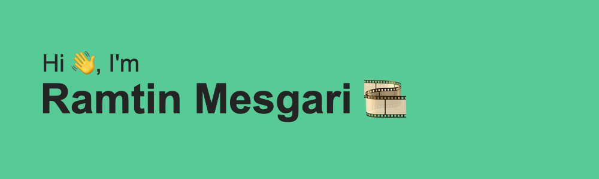

I'm a 🚀 Full-stack Engineer with a strong focus on the payments space. I have a great passion for user-centric design and enjoy exploring the intersection of payments and Web3 technologies.

Currently delving deeper into Web3, exploring functional languages and building DApps on Solana and NEAR platforms. Outside of coding, I enjoy photography with my 35mm film camera, diving into Russian literature, and competing in short story contests.

## 📆 What I'm Currently Working On
- 💳 Developing secure and scalable payment solutions integrations in the SoftPOS space.
- 🌐 Exploring the potential of Web3 and decentralized finance.
- 🎨 Advocating for strong UI/UX design principles in all my projects.

## 🧑🏻‍💻 Tech Stack
- **Languages:** TypeScript, NodeJS, Angular, React, Java, Kotlin, Rust (getting there)
- **Infrastructure:** AWS, GCP, Kubernetes, Terraform
- **Blockchain:** Solana, NEAR

## 🧠 Work Highlights
- Designed and developed customer-facing portals for merchants to manage transaction data and analytics.
- Built a developer portal for seamless application development.
- Integrated SDKs for eCommerce checkouts and custom MPOS Android apps.
- Transformed payment tracking systems for leading banks.
- Integrated regulatory reporting processes to ensure smooth compliance.

## 🏆 GitHub Profile

## 🤝 Get in Touch

